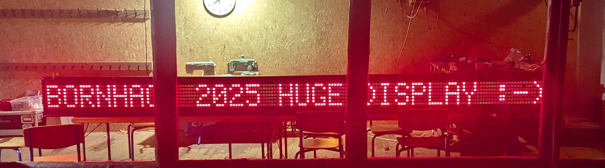

# BornHack LED Matrix Driver

## Description

The LED matrix at BornHack also known as "BornHack Huge display" is an old, monochrome 180x7 matrix.
Each pixel is made up of 4 red LEDs.

Based on the TI SN74HC164 shift registers used to shift out data into every row.
The currently selected row 1-7 is controlled by digital signals (active high).

Currently only shows static text. Interesting features to add can be:

- Bar stats
- Next talk
- Weather
